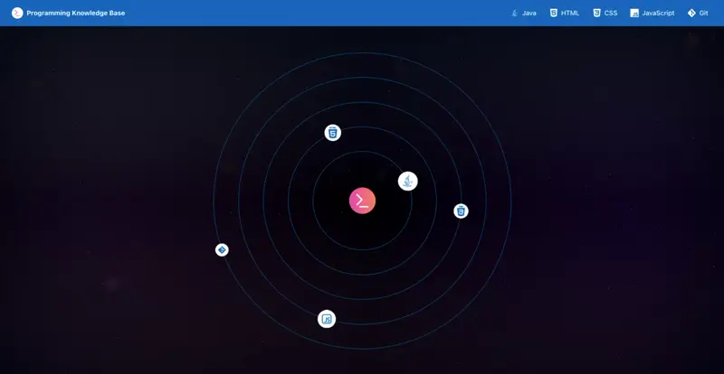

# Programming Knowledge Base

An interactive web application showcasing fundamental programming languages and technologies. It contains comprehensive notes, examples, and quick code references for essential programming concepts.

  
  <a href="https://yauheniya-adesso.github.io/programming-knowledge-base/">Live Demo ></a>

## Tech Stack
-  JavaScript - Core programming language
-  React - Frontend framework
-  Tailwind CSS - Utility-first CSS framework
-  Vite - Build tool and development server

## Deployment
-  GitHub Pages

## License
MIT 

## Acknowledgements

- [IBM Java Developer](https://www.coursera.org/professional-certificates/java-developer?utm_medium=sem&utm_source=gg&utm_campaign=b2c_emea_x_multi_ftcof_career-academy_cx_dr_bau_gg_pmax_gc_s1_en_m_hyb_23-12_desktop&campaignid=20858198824&adgroupid=&device=c&keyword=&matchtype=&network=x&devicemodel=&creativeid=&assetgroupid=6490027433&targetid=&extensionid=&placement=&gad_source=1&gad_campaignid=20854471652&gbraid=0AAAAADdKX6aHn8zRzj4KZlpK4sRDG4nWW&gclid=EAIaIQobChMIgvb0vf2akgMVqJODBx2xCTI1EAAYASAAEgKG2vD_BwE) course on Coursera for comprehensive materials on Java, HTML, CSS, JavaScript, and Git

- [Press Start Button (Synthwave & Starfield) - CSS by Josetxu](https://codepen.io/josetxu/pen/YPWWMbe) on  CodePen for the "Star Travel" animation on the homepage

