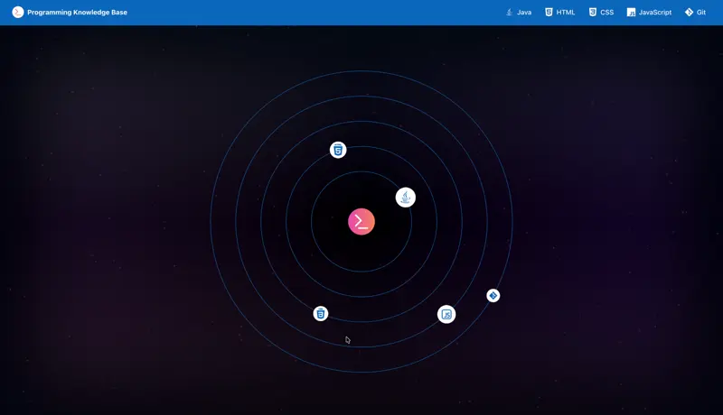

# Programming Knowledge Base

An interactive web application showcasing fundamental programming languages and technologies. It contains comprehensive notes, examples, and quick code references for essential programming concepts.

  
  <a href="https://yauheniya-adesso.github.io/programming-knowledge-base/">Live Demo ></a>

## Tech Stack
-  JavaScript - Core programming language
-  React - Frontend framework
-  Tailwind CSS - Utility-first CSS framework
-  Vite - Build tool and development server

## Deployment
-  GitHub Pages

## License
MIT 

## Acknowledgements

- [Java Developer course from  IBM on  Coursera](https://www.coursera.org/professional-certificates/java-developer)for comprehensive materials on Java, HTML, CSS, JavaScript, and Git

- [Developing Front-End Apps with React course from  IBM on  Coursera](https://www.coursera.org/learn/developing-frontend-apps-with-react/home/welcome) for great materials on React

- [Press Start Button (Synthwave & Starfield) - CSS by Josetxu](https://codepen.io/josetxu/pen/YPWWMbe) on  CodePen for the "Star Travel" animation on the homepage

- [Duke Car](https://hg.openjdk.org/duke/duke/) – 3D Duke Car model from the  OpenJDK project for the Java language page

